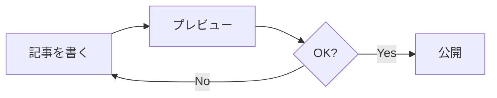

このブログは MDX（Markdown + JSX）で記事を書いています。プレーンな Markdown の手軽さを保ちつつ、`remark` / `rehype` プラグインや React コンポーネントで表現を拡張できるのが利点です。

このページは「どう書くと、どう表示されるか」をソース付きでまとめた**自分用のチートシート**です。各セクションは「書き方（ソース）→ 表示結果」の順に並べています。

## 見出し

`##` が h2、`###` が h3 です（h1 はタイトルが使うので本文では使いません）。見出しには自動でアンカーリンクが付きます（`rehype-slug` + `rehype-autolink-headings`）。

````md
## 大見出し
### 小見出し
````

## 強調・リスト・引用

````md
**太字** と *斜体* と `インラインコード`

- 箇条書き
- 箇条書き
  - ネスト

1. 番号付き
2. 番号付き

> 引用ブロック
````

**太字** と *斜体* と `インラインコード`

- 箇条書き
- 箇条書き
  - ネスト

> 引用ブロック

## 表・タスクリスト・打ち消し・脚注（GFM）

`remark-gfm` により GitHub 風の拡張が使えます。

````md
| 形式 | 埋め込み | 学習コスト |
| ---- | :------: | ---------- |
| Markdown | × | 低 |
| MDX | ○ | 中 |

- [x] 完了したタスク
- [ ] 未完了のタスク

~~打ち消し線~~

脚注も書けます[^1]。

[^1]: これが脚注の中身です。
````

| 形式 | 埋め込み | 学習コスト |
| ---- | :------: | ---------- |
| Markdown | × | 低 |
| MDX | ○ | 中 |

- [x] 完了したタスク
- [ ] 未完了のタスク

~~打ち消し線~~

脚注も書けます[^1]。

[^1]: これが脚注の中身です。

## コードブロック

言語名を付けるとシンタックスハイライト（`rehype-pretty-code` + shiki）され、言語ラベルとコピーボタンが付きます。

`{1,3-4}` のように書くと**行ハイライト**、`// [!code highlight]` でも個別の行を強調できます。

````md
```ts {2}
function greet(name: string) {
  return `Hello, ${name}!`; // この行がハイライトされる
}
```
````

```ts {2}
function greet(name: string) {
  return `Hello, ${name}!`; // この行がハイライトされる
}
```

## メッセージボックス `:::message`

補足やヒントを目立たせる情報ボックス（`remark-directive`）。

````md
:::message
ここは情報ボックスです。補足やヒントを書きます。
:::
````

:::message
ここは情報ボックスです。補足やヒントを書きます。
:::

## 警告ボックス `:::alert`

注意喚起の警告ボックス。`:::message{.alert}` と書いても同じです。

````md
:::alert
ここは警告ボックスです。注意点や落とし穴を書きます。
:::
````

:::alert
ここは警告ボックスです。注意点や落とし穴を書きます。
:::

## アコーディオン `:::details[タイトル]`

クリックで開閉できる折りたたみブロック。タイトルは `[ ]` の中に書きます。

````md
:::details[クリックで開く詳細]
折りたたまれた中身。長い補足やコードを隠せます。
:::
````

:::details[クリックで開く詳細]
折りたたまれた中身。長い補足やコードを隠せます。
:::

## 図（Mermaid）

` ```mermaid ` のコードブロックがフローチャートやシーケンス図になります（`rehype-mermaid`、ブラウザ側で描画）。記法は [Mermaid 公式ドキュメント](https://mermaid.js.org/) を参照。

````md

````


## リンク

外部リンク（`http(s)://` で始まるもの）には自動で別タブ表示・`rel="noopener"`・末尾アイコンが付きます（`rehype-external-links`）。内部リンクはそのままです。

````md
[外部サイト](https://example.com) と [内部リンク](/posts/hello-world)
````

[外部サイト](https://example.com) と [内部リンク](/posts/hello-world)

## 画像

`public/` 配下の画像を Markdown 記法で参照できます（basePath は自動付与）。

````md

````


最適化したい場合は MDX 内に直接 `next/image` を JSX で書けます（`width` / `height` 必須）。

````mdx
<Image src="/images/sample-cover.png" width="1200" height="630" alt="説明" />
````

<Image src="/images/sample-cover.png" width="1200" height="630" alt="next/image のサンプル" />
